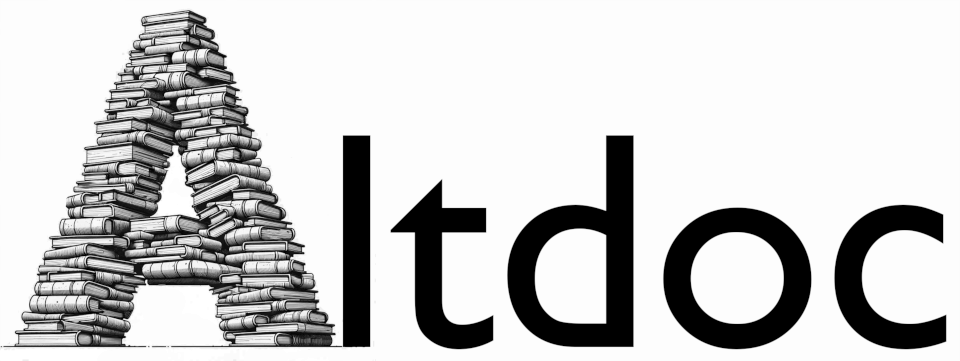

<div align="center">

<br>


<a href = "https://altdoc.etiennebacher.com/#/" target = "_blank"></a>
  
</div>

`altdoc` is a simple and powerful package to create documentation websites for `R` packages. It is a more flexible alternative to [`pkgdown`.](https://pkgdown.r-lib.org/) Its features include:

* Support for several documentation frameworks:
  - [Quarto websites](https://quarto.org/docs/websites/)
  - [Docsify](https://docsify.js.org/#/)
  - [MkDocs](https://www.mkdocs.org/). 
  - [Docute](https://docute.egoist.dev//)
* Render:
  - Quarto and Rmarkdown vignettes.
  - Reference pages for exported functions, along with evaluated examples.
  - Common sections: `README.md`, `NEWS.md`, `CHANGELOG.md`, `CODE_OF_CONDUCT.md`, `CITATION.md`, etc.
* Preview the site: 
  - Browser 
  - RStudio Viewer
* Deploy the website: 
  - Github pages
  - Other platforms

## Installation

You can install the CRAN version:
```r
install.packages("altdoc")
```

You can also install the development version to benefit from the latest bug fixes:
```r
remotes::install_github("etiennebacher/altdoc")
```

## Quick start

A typical workflow with `altdoc` is to execute these commands from the root directory of the package:

```r
### Create the website structure for one of the documentation generators
setup_docs(tool = "docsify")
# setup_docs(tool = "docute")
# setup_docs(tool = "mkdocs")

### Render the vignettes and man pages
render_docs()

### Preview the website
preview_docs()
```

See [the Get Started vignette](vignettes/get-started.md) for more details.

## Demos

Websites created with `altdoc`:

* [altdoc](https://altdoc.etiennebacher.com/) itself (Docute)
* [conductor](https://conductor.etiennebacher.com/) (Docsify)

Websites created with the documentation generators supported by `altdoc`:

* [firebase](https://firebase.john-coene.com/) by John Coene (uses Mkdocs, theme Material)
* [sever](https://sever.john-coene.com/) by John Coene (uses Mkdocs, theme readthedocs)

## More

More details on the package and the deployment are available on the [website](https://altdoc.etiennebacher.com/#/). 

The initial version of the logo was created with Chat-GPT and edited in Gimp by Vincent Arel-Bundock.