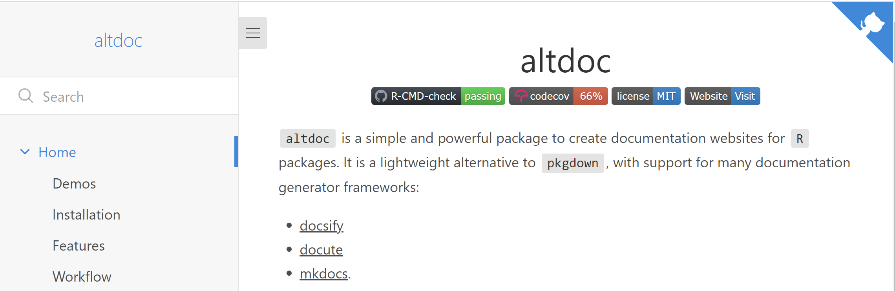
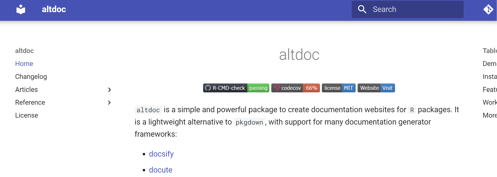

# Customize

The `altdoc/` directory is created when you call `setup_docs()`. It
stores the basic settings that `altdoc` uses to render the documentation
website. To customize your documentation website, you can edit the
settings files stored in the `altdoc/` directory before calling
`render_docs()`.

Note that the contents of `altdoc/` are never modified when you update
the website with `render_docs()`. Therefore, you can safely edit the
settings files by hand to customize your website. (Warning: `altdoc/`
can be overwritten if you call `setup_docs()` again with the
`overwrite=TRUE` argument.)

Each of the documentation engines that `altdoc` supports offers
extensive theming and customization options. This vignette illustrates
the process using minimal examples for each engine, and provides links
to the relevant documentation of each engine for users who want to dive
deeper.

## Docsify

Docsify supports many themes and offers extensive configuration
possibilities. Here, we show a minimal example using the Themeable
framework. For more information, see:

-   [Docsify User Guide](https://docsify.js.org/#/)
-   [Themeable for
    Docsify](https://jhildenbiddle.github.io/docsify-themeable/#/)

Initialize the documentation website settings:

``` r
library(altdoc)
setup_docs("docsify")
```

Edit the `altdoc/docsify.html` file. For example, to use the Themeable
framework for Docsify, we only have to insert two lines in the settings
file.

First, we replace the default Docsify theme with:

``` html
<link rel="stylesheet" href="https://cdn.jsdelivr.net/npm/docsify-themeable@0/dist/css/theme-simple.css">
```

Then, after the Docsify script, we insert:

``` html
<script src="https://cdn.jsdelivr.net/npm/docsify-themeable@0/dist/js/docsify-themeable.min.js"></script>
```

The full modified HTML template is shown below.

Render the documentation:

``` r
render_docs()
```

Here is a preview of the result:



Click on Details to display the full HTML template:

<details>

``` html
<!-- index.html -->
<!DOCTYPE html>
<html>
<head>
  <meta http-equiv="X-UA-Compatible" content="IE=edge,chrome=1">
  <meta name="viewport" content="width=device-width,initial-scale=1">
  <meta charset="UTF-8">
  <!-- Theme: Simple (light + dark) -->
  <link rel="stylesheet" href="https://cdn.jsdelivr.net/npm/docsify-themeable@0/dist/css/theme-simple.css">

</head>
<body>
  <div id="app"></div>
  <script>
    window.$docsify = {
      name: '$ALTDOC_PACKAGE_NAME',
      repo: '$ALTDOC_PACKAGE_URL_GITHUB',
      loadSidebar: true,
      subMaxLevel: 2,
      search: {
        placeholder: 'Search',
        depth: 3,
      },
      auto2top: true,
      copyCode: {
        buttonText : 'Copy',
        errorText  : 'Error',
        successText: 'Copied'
      },
      plugins: [
        function(hook) {
          var footer = ["<a href='$ALTDOC_PACKAGE_URL'> <code> $ALTDOC_PACKAGE_NAME </code> v. $ALTDOC_PACKAGE_VERSION </a> | Documentation made with <a href='https://altdoc.etiennebacher.com/'> <code> altdoc </code> v. $ALTDOC_VERSION</a>"].join('');

          hook.afterEach(function(html) {
            return html + footer;
          });
        }
      ]
    }
  </script>
  <script src="//cdn.jsdelivr.net/npm/docsify@4"></script>
  <script src="https://cdn.jsdelivr.net/npm/docsify-themeable@0/dist/js/docsify-themeable.min.js"></script>
  <script src="//cdn.jsdelivr.net/npm/docsify-copy-code"></script>
  <script src="//cdn.jsdelivr.net/npm/prismjs@1.24.1/components/prism-r.js"></script>
  <script src="//unpkg.com/docsify/lib/plugins/search.min.js"></script>
</body>
</html>
```

</details>

## MkDocs

MkDocs supports many themes and offers extensive configuration
possibilities. Here, we show a minimal example using the Material theme.
For more information, see:

-   [MkDocs User Guide](https://www.mkdocs.org/user-guide/)
-   [Material for
    MkDocs](https://squidfunk.github.io/mkdocs-material/customization/)

First, install both the `mkdocs` and `mkdocs-material` package for
Python:

``` bash
pip install mkdocs mkdocs-material
```

Initialize the documentation website settings:

``` r
library(altdoc)
setup_docs("mkdocs")
```

Edit the `altdoc/mkdocs.yml` file. What follows is a minimal example in
which took the default MkDocs settings that `altdoc` creates, and we
modified only top lines to add the Material theme:

``` yaml
### Theme
theme:
  name: material

### Basic information
site_name: $ALTDOC_PACKAGE_NAME

### Repo information
repo_url: $ALTDOC_PACKAGE_URL
repo_name: $ALTDOC_PACKAGE_NAME

### Plugins
plugins:
  - search

### Navigation tree
nav:
  - Home: README.md
  - Changelog: $ALTDOC_NEWS
  - Articles: $ALTDOC_VIGNETTE_BLOCK
  - Reference: $ALTDOC_MAN_BLOCK
  - Code of Conduct: $ALTDOC_CODE_OF_CONDUCT
  - License: $ALTDOC_LICENSE
```

Render the documentation:

``` r
render_docs()
```

Here is a preview of the result:



## Docute

The Docute website hosts a detailed guide on customization. As with the
other documentation engines, the strategy is to customize the settings
files stored in the `altdoc/` directory, before calling `render_docs()`.

-   [Docute Customization
    Guide](https://docute.egoist.dev/guide/customization)

## Pre and post-processing

### Post-processing: Docsify and Docute

The Docsify and Docute documentation systems generate documentation on
the fly in the browser. They use no statically built HTML files or
settings files. This means that users can edit the files in `docs/`
directly and see their changes reflected in the documentation website
immediately. This is a powerful feature, because it means that users can
use scripts to operate on the `docs/` directory for deep customization.

For example, let’s create a new Docsify documentation site:

``` r
library(altdoc)
setup_docs("docsify")
```

Let’s say we want to display the vignettes in reverse alphabetical order
in the sidebar. First, edit `altdoc/docsify.md` to make it more
minimalist:

``` markdown
* [Home](/)
```

Then, we render the documentation:

``` r
render_docs()
```

Finally, we run an `R` script to add a new section to the sidebar
settings:

``` r
files <- rev(list.files("docs/man", pattern = "\\.md$"))
files <- sprintf(
  "  - [%s](man/%s)",
  gsub("\\.md$", "", files),
  files
)
settings <- readLines("docs/_sidebar.md")
settings <- c(settings, "* Articles: ", files)
writeLines(settings, "docs/_sidebar.md")
```

### Pre-processing: MkDocs and Quarto

The Quarto and MkDocs use statically built HTML files, search, and
settings file. This means that users can write scripts for deep
customization of their websites, but they must execute them *before*
calling `render_docs()`. A typical workflow could work like this.

First, create a MkDocs documentation structure:

``` r
library(altdoc)
setup_docs("mkdocs")
```

Rename `altdoc/mkdocs.yml` to `altdoc/mkdocs_static.yml`:

``` bash
mv altdoc/mkdocs.yml altdoc/mkdocs_static.yml
```

Edit the settings file manually to make it minimalist:

``` yaml
site_name: $ALTDOC_PACKAGE_NAME
nav:
  - Home: README.md
```

Write a script to customize the settings and save an edited file to
`altdoc/mkdocs.yml`, and then render the website:

``` r
library(yaml)

# read the static settings
yml <- read_yaml("altdoc/mkdocs_static.yml")

# Create a list of links in the appropriate structure to insert in the sidebar
links <- rev(list.files("man", pattern = "\\Rd$"))
links <- setNames(
  paste0("man/", gsub("\\.Rd", ".md", links)),
  gsub("\\.Rd$", "", links)
)
links <- as.list(rev(links))

# Insert the links in the settings
yml$nav <- c(
  yml$nav,
  list(list(Functions = links)))

# Write the settings to the `altdoc/` directory
write_yaml(yml, "altdoc/mkdocs.yml")

# Render the documentation
render_docs()
```

##### Test

The code and images in this section are inserted as a demonstration of
images in Quarto vignettes.

``` r
with(mtcars, plot(mpg, wt))
```


